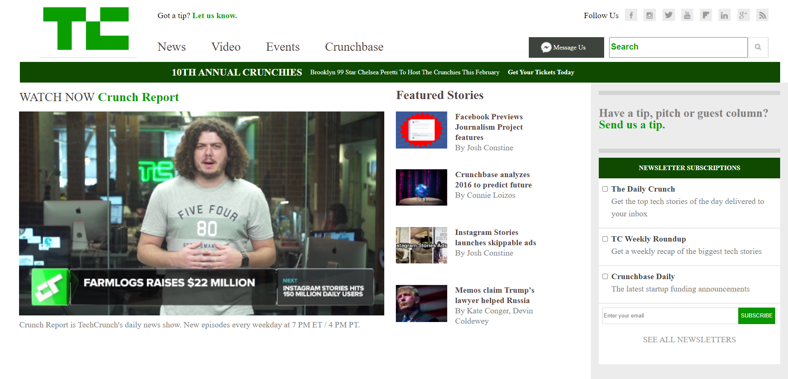

TechCrunch Template Site
HTML5, CSS3 - Tech Crunch site 

 

Link to site: https://responsivedemosite1.netlify.app/

How It's Made:

Tech used: HTML5, CSS3

My learning was focused on using floats rather than flex/grid, simply to understand how to use it correctly and practice with media queries.

Optimizations

I ensured that all floated elements are floated to the left rather than floating some left and some right, to make sure that there were no issues with the order in which elements were displaying. 

Lessons Learned:

I learned to make content decisions as the screen size of a device decreases, to only display the most necessary elements. 

